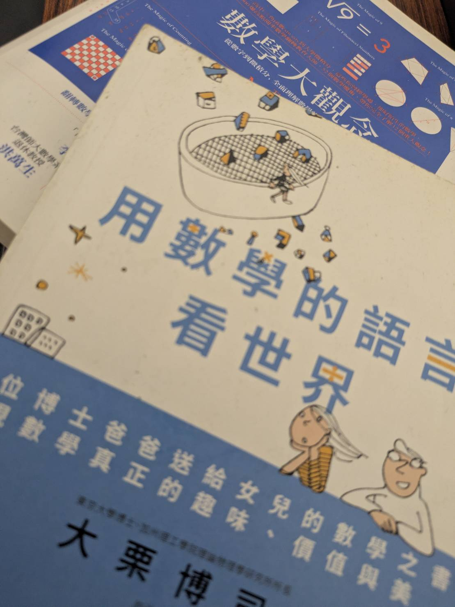

---

<figure id="fig1" style="float: right; clear: right; width: 250px; margin: 0.35rem -15rem 1rem 1.5rem;">
  
  <figcaption style="margin-top: 0.4em; font-size: 0.85em; color: #6e5631; text-align: center; font-style: italic;">
    1.　用數學的語言看世界 & 數學大觀念 
  </figcaption>
</figure>

整理房間的時候，翻到以前高中買的課外書。書頁有點泛黃了，書角也捲起來。裡面有些寫古人的奇聞趣事，有些寫有趣的數學問題<a href="#fig1" class="fig-ref">1</a>。那個時候的我很常看這些東西，我知道考試不會考，我也知道就算看懂了，未來大概也沒有什麼機會真的用上。

現在回頭看，過了六、七年，我對這件事的想法其實沒有變太多。那些內容依然像是某種無用的知識，不會因為懂了就讓生活變得比較順利，也不會真的替人生解決什麼問題(*甚至我的大考國文只拿了60幾分，大學微積分也只有60分*)。它們安安靜靜地待在房間的某個角落，像是某種灰塵收集器，沒有明確的目的，也沒有誰會來檢查我到底記住了多少。

> 我不討厭這樣的學習，我喜歡那種有點挑戰、卻又不到讓人想放棄的問題。
 
有些學習不是梯子，也不是路標。它不一定要把人帶去哪裡。它只是搔到一點好奇心，於是我停下來多看幾眼。沒有別的理由，只是覺得有趣。

我現在還是覺得，那些是無用的知識。但我很喜歡。